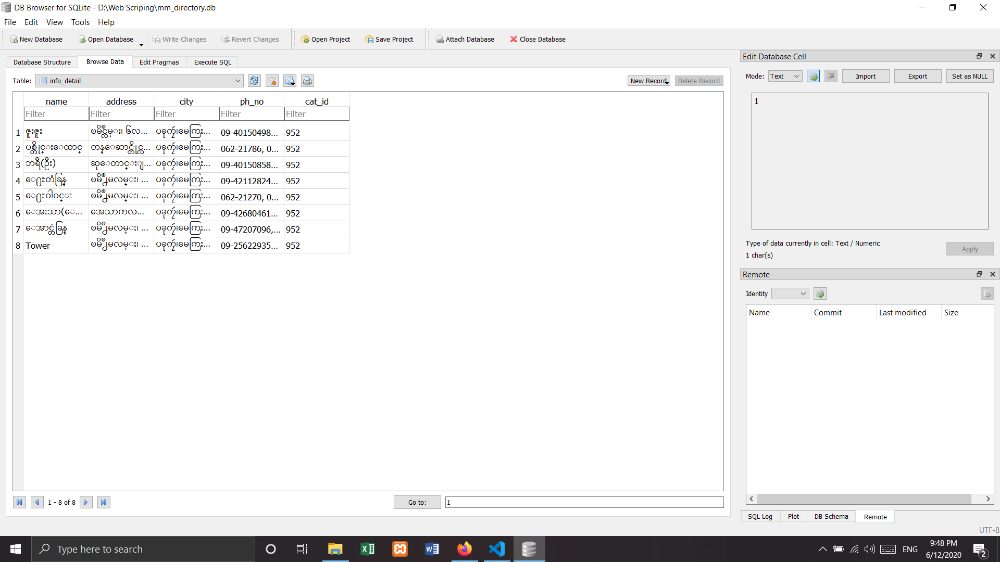

# myanmarbusiness-directory-get-data" 

## Result Example



``` PS D:\Web Scriping> python .\mm-directory.py

            Welcome
            Please choose number:
            1 : 'Get City List'
            2 : 'Get Category List of City'
            3 : 'Get Info Detail One Category'
            4 : 'Get All Info Detail Category List of City'

1
Loading......
Complete City List Download
Are you continue? (yes,no)yes

            Welcome
            Please choose number:
            1 : 'Get City List'
            2 : 'Get Category List of City'
            3 : 'Get Info Detail One Category'
            4 : 'Get All Info Detail Category List of City'

2
Enter a city namePakokku
Loading......
Complete Category List Download
['952', '288', '47', '221', '539', '165', '181', '154', '196', '170', '199', '164', '195', '163', '327', '189', '185', '155', '190', '198', '157', '191', '167', '168', '173', '175', '203', '244', '554', '60', '276', '423', '463', '317', '473', '396', '825', '959', '828', '807', '258', '308', '200', '256', '250', '254', '91', '213', '929', '939', '227', '645', '470', '286', '928', '437', '435', '306', '634', '458', '52', '429', '553', '537', '284', '324', '391', '390', '394', '822', '879', '277', '882', '878', '563', '880', '2', '113', '112', '114', '750', '754', '791', '416', '403', '401', '408', '405', '409', '410', '414', '402', '278', '209', '228', '140', '673', '674', '574', '592', '92', '508', '477', '383', '13', '12', '11', '103', '150', '815', '280', '234', '236', '220', '596', '487', '483', '683', '668', '469', '333', '263', '265', '264', '851', '846', '804', '803', '802', '712', '366', '426', '551', '977', '920', '67', '636', '635', '933', '973', '912', '953', '685', '464', '509', '918', '557', '573', '371', '567', '99', '30', '543', '434', '687', '380', '1061', '238', '239', '296', '260', '598', '597', '427', '727', '709', '708', '703', '705', '706', '58', '57', '572', '118', '83', '82', '848', '698', '206', '43', '829', '725', '430', '146', '947', '1024', '1015', '995', '998', '1001', '1026', '1017', '1013', '994', '1005', '1022', '1010', '1003', '1007', '1008', '1000', '153', '857', '855', '856', '382', '378', '374', '686', '367', '976', '986', '980', '988', '45', '130', '550', '96', '95', '211', '866', '666', '490', '110', '481', '78', '72', '70', '616', '608', '444', '541', '387', '216', '724', '637', '626', '627', '624', '628', '623', '621', '612', '611', '613', '610', '1044', '688', '689', '261', '262', '615', '372', '661', '231', '638', '376', '721', '448', '422', '530', '375', 
'809', '501', '329', '500', '498', '746', '1049', '654', '1034', '1035', '640', '1041', '992', '229', '125', '453', '452', '273', '19', '446', '325', '693', '914', '534', '536', '831', '340', '342', '343', '344', '345', '285', '66', '368', '379', '609', '124', '925', '561', '560', '647', '1048', '827', '603', '931', '525', '604', 
'326', '927', '667', '821', '1059', '425', '526', '301', '104', '428', '494', '497', '872', '743', '297', '824', '589', '644', '461', '888', '270', '433', '923', '373', '332', '355', '713', '676', '32', '547', '602', '462', '504', '27', '568', '28', '283', '86', '137', '136', '1028', '859', '44', '245', '513', '875', '874', '350', '339', '474', '247', '552', '365', '359', '360', '520', '207', '55', '123', '241', '833', '834', '905', '835', '89', '741', '134', '514', '681', '495', '348']       
Are you continue? (yes,no)yes

            Welcome
            Please choose number:
            1 : 'Get City List'
            2 : 'Get Category List of City'
            3 : 'Get Info Detail One Category'
            4 : 'Get All Info Detail Category List of City'

3
Enter a city namePakokku
Enter a category id952
Loading......
ဇူးဇူး
(ကစားစရာဆိုင္မ်ား)
ၿမိဳင္လမ္း၊ ၆လမ္း ႏွင့္ ၇လမ္း ၾကား၊ အမွတ္(၁၁)ရပ္ကြက္၊
ပခုကၠဴ၊မေကြးတိုင္းေဒသႀကီး
09-401504987, 09-971514000
ပစ္တိုင္းေထာင္
(ကစားစရာဆိုင္မ်ား)
တန္ေဆာင္တိုင္လမ္း၊ အမွတ္(၉)ရပ္ကြက္၊
ပခုကၠဴ၊မေကြးတိုင္းေဒသႀကီး
062-21786, 09-427209437, 09-774084588
ဘရီ(ဦး)
(ကစားစရာဆိုင္မ်ား)
ဆုေတာင္းျပည့္ဘုရားလမ္း၊ အမွတ္(၁)ရပ္ကြက္၊
ပခုကၠဴ၊မေကြးတိုင္းေဒသႀကီး
09-401508589, 062-21317
ေ႐ႊတံခြန္
(ကစားစရာဆိုင္မ်ား)
ၿမိဳ႕မလမ္း၊ အေသာကလမ္း ေထာင့္၊ အမွတ္(၁)ရပ္ကြက္၊
ပခုကၠဴ၊မေကြးတိုင္းေဒသႀကီး
09-421128248, 09-421120065, 09-421128139
ေ႐ႊဝါဝင္း
(ကစားစရာဆိုင္မ်ား)
ၿမိဳ႕မလမ္း၊ အမွတ္(၈)ရပ္ကြက္၊
ပခုကၠဴ၊မေကြးတိုင္းေဒသႀကီး
062-21270, 09-2300270
ေအးသာ(ေဒၚ)
(ကစားစရာဆိုင္မ်ား)
အေသာကလမ္း၊ အမွတ္(၄)ရပ္ကြက္၊
ပခုကၠဴ၊မေကြးတိုင္းေဒသႀကီး
09-426804611, 062-23211
ေအာင္တံခြန္
(ကစားစရာဆိုင္မ်ား)
ၿမိဳ႕မလမ္း၊ အမွတ္(၈)ရပ္ကြက္၊
ပခုကၠဴ၊မေကြးတိုင္းေဒသႀကီး
09-47207096, 09-774080370
Tower
(ကစားစရာဆိုင္မ်ား)
ၿမိဳ႕မလမ္း၊ ဗုဒၶကုန္းရပ္၊ အမွတ္(၁)ရပ္ကြက္၊
ပခုကၠဴ၊မေကြးတိုင္းေဒသႀကီး
09-256229353, 09-429279301
Complete info Detail Download
Are you continue? (yes,no)
```
  
